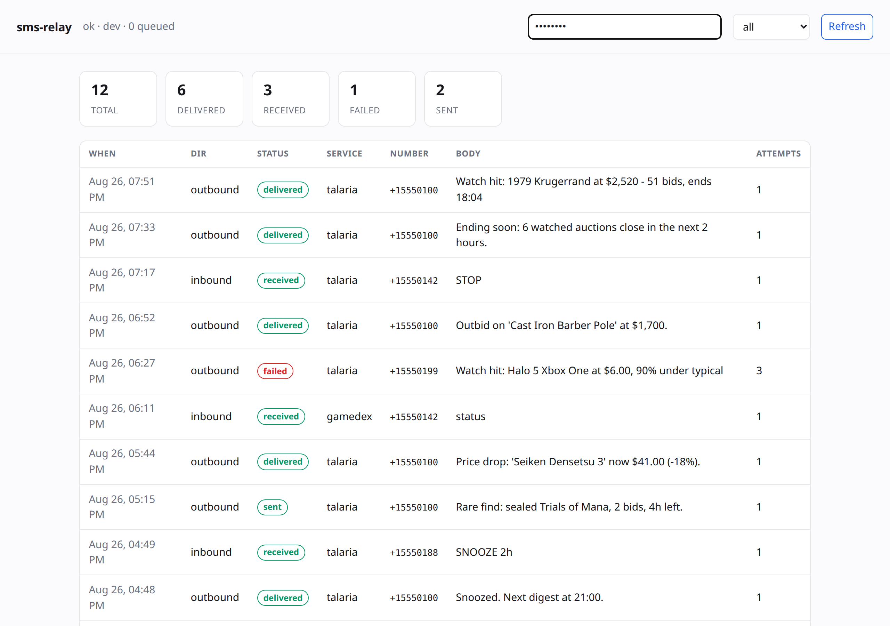
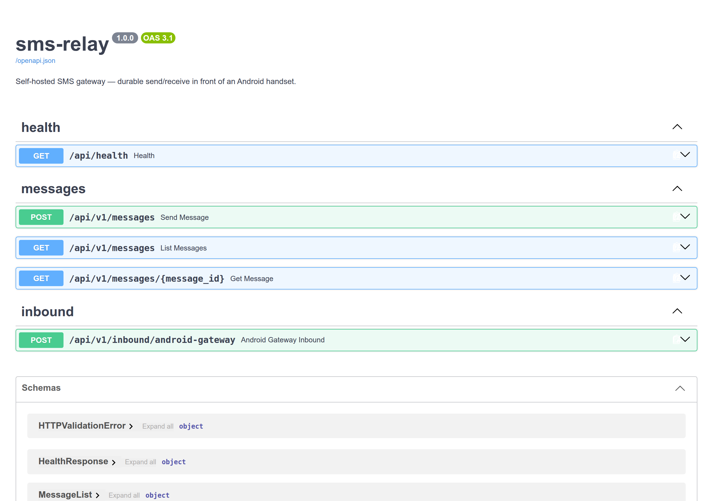

<div align="center">


[](https://github.com/zdiemer/sms-relay/actions/workflows/build.yml)


</div>

# sms-relay

A self-hosted SMS gateway for the cluster — the thing every other service calls
instead of holding phone credentials of its own. Sends and receives real text
messages through an Android handset running
[SMS Gateway for Android](https://github.com/capcom6/android-sms-gateway),
with the durability layer a bare handset doesn't have.

Runs at `sms-relay.zachd.duckdns.org` in the `infra` namespace.

## Screenshots

Invented traffic on a demo instance
([`docs/capture/serve_demo.py`](docs/capture/serve_demo.py)) running the
built-in `dev` provider, which writes to a directory instead of a handset. No
real number, message body or gateway credential is involved.

<table>
<tr>
<td width="58%"><br>
<sub><b>Log</b> — every message, its status and how many attempts it took. A
caller sees its own outbound plus every inbound, which is the scoping the API
enforces.</sub></td>
<td width="42%"><br>
<sub><b>API</b> — send, fetch, list, and the handset's inbound webhook.</sub></td>
</tr>
</table>

## Why this exists

A handset running an HTTP gateway is a fine SMS transport and a poor SMS API.
It is asleep, off wifi, or between IP addresses more often than you'd like, and
when it is, a naive `POST` just fails. Services that call it directly end up
either dropping messages or each growing their own half of a retry queue.

This puts one durable layer in front of it:

- **Sends survive the handset.** Messages are persisted on arrival and retried
  with exponential backoff (5 attempts by default). A phone that is unreachable
  delays delivery; it doesn't lose it.
- **Every message is on the record**, with status, attempt count and last error.
- **Delivery status** is tracked through to `delivered` using gateway receipts.
- **Idempotency keys** make a caller's own retry safe — replaying a send returns
  the original message instead of texting twice.
- **Rate limiting** (default 30/min) keeps a burst from being silently dropped
  by the handset.
- **Inbound SMS** is received, stored, and fanned out to subscriber services
  over signed webhooks.
- **E.164 normalization** via libphonenumber, so callers can pass whatever
  format they have.
- **Credentials live here only.** Consumers hold an API key, not your phone.

## API

All endpoints except `/api/health` and the inbound webhook need an API key,
either `Authorization: Bearer <key>` or `X-API-Key: <key>`. Keys map to a
service name, and that name is recorded on every message.

### Send

```bash
curl -X POST https://sms-relay.zachd.duckdns.org/api/v1/messages \
  -H "X-API-Key: $KEY" -H 'Content-Type: application/json' \
  -d '{"to": "2025550101", "body": "hello", "idempotency_key": "optional"}'
```

Returns `202` with the queued message(s). `to` accepts a single number or a
list, in any format libphonenumber understands. A repeat POST with the same
`idempotency_key` returns the original message rather than sending twice.

The response is *acceptance*, not delivery — poll `GET /api/v1/messages/{id}`
if you need the outcome. Callers should never block on the handset.

### Read

- `GET /api/v1/messages/{id}` — one message
- `GET /api/v1/messages?direction=&status=&limit=&offset=` — the log

Outbound messages are visible only to the service that sent them; inbound is
visible to every authenticated caller, since it has no single owner.

### Receive

The handset POSTs to `/api/v1/inbound/android-gateway`, signing the raw body
with `SMS_RELAY_WEBHOOK_SECRET` (HMAC-SHA256, `X-Signature`). Each inbound
message is stored, then pushed to every configured subscriber:

```json
{
  "event": "message.received",
  "message": {"id": "...", "from": "+1...", "to": null,
              "body": "...", "received_at": "..."}
}
```

Subscribers are configured in `values.local.yaml`. Each gets its own retry
schedule (6 attempts, backoff to an hour) so one dead consumer doesn't hold up
the others. If a subscriber has a `secret`, its payload is signed the same way
— verify it before trusting the body.

### Status

`GET /api/health` — DB reachability, provider, queue depth. Deliberately open
(the kubelet has no API key) and deliberately *not* a probe of the handset: the
phone being briefly unreachable is what the queue is for, and failing readiness
would restart the pod that owns the queue.

A read-only log viewer is served at `/`, behind Authelia.

## Deploying

Same shape as everything else in the selfhosted repo:

```bash
cp values.local.yaml.example values.local.yaml   # fill in, gitignored
kubectl create namespace infra                   # if it doesn't exist
./build.sh                                       # → registry.zachd.duckdns.org/zdiemer/sms-relay:vN
./upgrade.sh
```

Bump `image.tag` in `values.yaml` and `appVersion` in `Chart.yaml` together
with the code, in one commit. `upgrade.sh` refuses to roll onto a tag that
isn't in the registry — `strategy: Recreate` means a typo would be an outage
rather than a failed rollout.

Bring the pod up with `ingress.enabled: false` first, confirm it's healthy,
then flip the ingress on.

### The handset

1. Install SMS Gateway for Android, enable local server mode, note the IP,
   username and password → `provider.gatewayUrl` / `secrets.gatewayUser` /
   `secrets.gatewayPassword`.
2. Give the phone a DHCP reservation. `gatewayUrl` is an IP; if it moves, sends
   queue and retry rather than fail, but nothing will get through until it's
   corrected.
3. For inbound, register a webhook in the gateway app pointing at
   `https://sms-relay.zachd.duckdns.org/api/v1/inbound/android-gateway` with
   the same secret as `secrets.webhookSecret`.

### Why there are two Ingress objects

The phone can't complete an Authelia login, so the inbound path can't sit
behind forward-auth. Traefik attaches middleware per *router* and has no
per-path exclusion — but separate Ingress objects are separate routers. So
`ingress.yaml` carries the forward-auth middleware and `ingress-webhook.yaml`
serves `/api/v1/inbound` without it. That path is not unauthenticated, it's
*differently* authenticated: the HMAC signature is checked before the handler
runs, and the service refuses inbound entirely if no secret is configured.

This is the only place in the cluster that does this. Don't "simplify" it back
into one Ingress.

## Development

```bash
uv venv .venv && uv pip install --python .venv/bin/python -e './app[dev]'
.venv/bin/python -m pytest app/tests -q
```

Set `SMS_RELAY_PROVIDER=dev` to write messages to files under
`SMS_RELAY_DEV_OUTPUT_DIR` instead of touching a handset — the full
queue/retry/fan-out path still runs. That's how the tests work, including
`test_fanout.py`, which stands up a real HTTP subscriber and asserts the
signature and retry behaviour.

## Notes

- SQLite on a ReadWriteOnce PVC. `replicas: 1` and `strategy: Recreate` are
  load-bearing — never run two writers.
- Numbers are redacted to the last four digits in logs. This service holds
  every message for every consumer, so its logs are a bigger target than any
  one caller's.
- Terminal messages are pruned after `SMS_RELAY_RETENTION_DAYS` (default 90) so
  the database doesn't grow forever on a 1Gi volume.
- There's no STOP/HELP keyword handling or consent tracking. Everything here
  goes to numbers that opted in elsewhere; if this ever sends to strangers,
  that needs to exist first.
